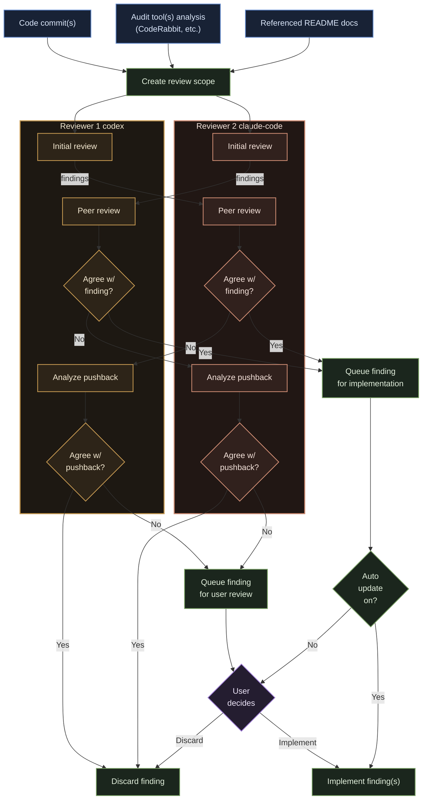

# roboreviewer

`roboreviewer` is an automated code reviewer CLI that marshals multiple CLI tools into one coordinated workflow for AI-assisted reviews.

Instead of manually interacting with several different AI tools for verifying code quality, `roboreviewer` captures, cross-references, validates, and implements feedback across configured tools.

## How it works

`roboreviewer`:

- Collects advisory findings from static audit tools like CodeRabbit when enabled
- Feeds the review diff, configured project docs, commit metadata, and filtered audit context to one or two CLI coding agents
- Applies a peer-review consensus mechanism when a second reviewer is configured
- Lets consensus recommendations be implemented automatically, or prompts for per-finding approval when manual approval mode is selected
- Prompts the user to resolve findings that do not reach consensus
- Uses the primary "Director" agent to update the working tree based on accepted findings
- Allows repeat smart scans that include the original review scope plus current workspace changes

---



## Setup Instructions

Follow [these instructions](docs/setup-instructions.md) to set up `roboreviewer` on your local machine.

## Commands

| Command                            | Purpose                                                                        |
| ---------------------------------- | ------------------------------------------------------------------------------ |
| `roboreviewer init`                | Initialize repository-specific `roboreviewer` configuration.                   |
| `roboreviewer review --last`       | Review the latest commit.                                                      |
| `roboreviewer review <commit-ish>` | Review a commit range from the included commit hash to the most recent commit. |
| `roboreviewer resume`              | Resume any paused review session from saved state.                             |

`roboreviewer review` requires a clean working tree at startup. Repeat scans prompted at the end of an iteration may include current unstaged and untracked workspace changes. `roboreviewer resume` continues from a saved cursor if the process was interrupted during manual consensus approval, conflict resolution, or final implementation.

## Available CLI Tools

Supported agent adapters in this build:

- `codex`
- `claude-code`
- `mock`

Supported built-in audit tool:

- `coderabbit`

When a selected tool is missing, `roboreviewer init` offers configured install help where available. Tool authentication remains a separate local setup step.

## `roboreviewer init`

Running `roboreviewer init` triggers the init setup wizard for each repository:

  <div style="max-width: 700px; border: 1px solid #555; border-radius:8px; overflow:hidden;">
    
  </div>

<br/>

and produces `.roboreviewer/config.json`

```json
{
  "schema_version": 1,
  "autoUpdate": false,
  "agents": {
    "director": {
      "tool": "codex"
    },
    "reviewers": [
      {
        "tool": "claude-code"
      }
    ]
  },
  "audit_tools": [
    {
      "id": "coderabbit",
      "enabled": true
    }
  ],
  "context": {
    "docs_path": "docs/spec/MVP",
    "max_docs_bytes": 200000
  }
}
```

Running `roboreviewer init` a second time requires confirmation to overwrite the existing configuration. The init helper also adds `.roboreviewer/` to `.gitignore`, so both config and runtime state are local by default in this build.

## `roboreviewer review`

Running `roboreviewer review <commit-ish>` or `roboreviewer review --last` starts a review workflow:

- resolve the commit range and build a reduced-context unified diff
- load configured `.md` or `.txt` documentation within the configured byte limit
- run enabled audit tools on the first scan only
- collect reviewer findings, peer-review them when a second reviewer is configured, and persist session state
- optionally prompt for consensus approvals when `autoUpdate` is `false`
- prompt for disputed finding decisions when needed
- ask whether to repeat the scan or end the session

The workflow writes `.roboreviewer/runtime/session.json` and session history under `.roboreviewer/runtime/history/`.

If a run is interrupted while a cursor is active, run `roboreviewer resume` to continue from saved state.

## License

This project is licensed under MIT.
