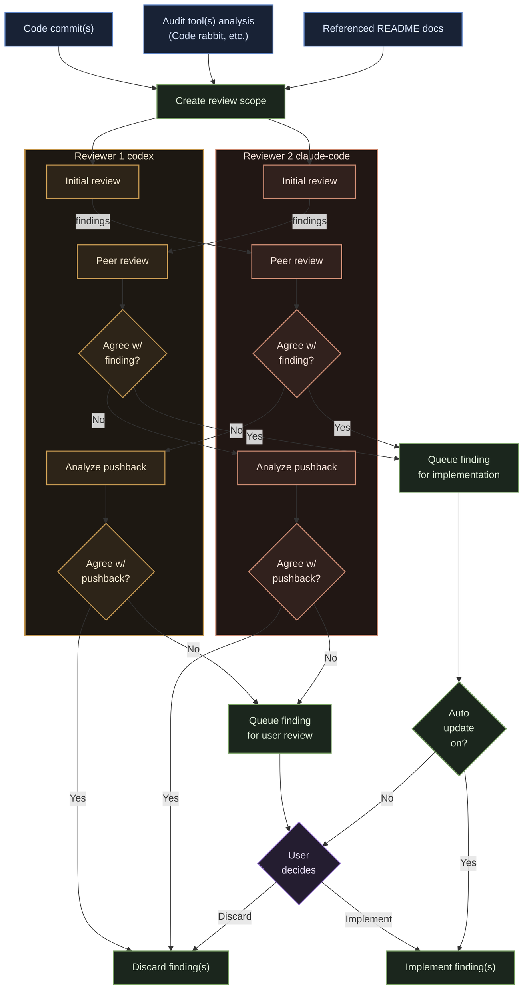

# Roboreviewer

Roboreviewer is an automated code reviewer that marshalls numerous CLI tools into one coordnated CLI workflow for AI assisted code reviews.

Instead of manually interacting with several different AI tools for verifying code quality, Roboreviewer implements an automated workflow that captures and cross-references feedback across numerous tools.

## How it works

Roboreviewer:

- Collects feedback from static audit tools like Code Rabbit
- Feeds commits, audit tool feedback and README docs to >=1 CLI coding agents (codex, claude code) for analysis
- Cross references findings and applies a peer-review consensus mechanism to reinforce confidence in updates.
- Provides the option to have recommendations updated automatically or after user approval.
- Requires user to tie-break findings that did not reach consensus across tools.
- Employs primary "Director" agent to automatically update code based on consensus.
- Allows repeat smart scans to ensure fewer issues fall through the cracks.

---



## Setup Instructions

Follow the instructions in [this doc](docs/setup-instructions.md) to set up Roboreviewer on your local machine.

## Commands

| Command                            | Purpose                                                              |
| ---------------------------------- | -------------------------------------------------------------------- |
| `roboreviewer init`                | Initialize repository-local Roboreviewer configuration.              |
| `roboreviewer review <commit-ish>` | Review a specific commit range or target revision.                   |
| `roboreviewer review --last`       | Review the latest commit only.                                       |
| `roboreviewer resolve`             | Continue the human resolution flow for queued non-consensus items.   |
| `roboreviewer resume`              | Resume an interrupted review or resolution session from saved state. |

## Available CLI Tools

If you do not already have one of these tools installed, it will be installed when you select it.

Supported agent adapters in this build:

- `codex`
- `claude-code`
- `mock`

Supported built-in audit tool:

- `coderabbit`

## Initializing Repo

Running `roboreviewer init` creates the committed repository config:

```text
.roboreviewer/config.json
```

That file stores the selected tools, docs settings, and `autoUpdate`.

A typical init flow looks like this:

```text
========================================
Roboreviewer Init Wizard
========================================

Configure roboreviewer for this repository.

========================================
Repository
========================================

? Do you have a docs folder to provide global context for the reviewers? Yes
? Docs path docs
? Max docs bytes 200000

========================================
Agents
========================================

? Pick the main tool (Director) for reviews and updates codex (installed)
? Add a second reviewer? Yes
? Second reviewer tool claude-code (installed)

========================================
Audit Tools
========================================

? Enable CodeRabbit audit tool? No

? How would you like to implement review recommendations:
  > Have recommendations implemented automatically when all roboreviewers agree
    Manually review each recommendation and approve or deny each change

========================================
Authentication
========================================

? Have you already authenticated Codex on this machine? Yes
? Have you already authenticated Claude Code on this machine? Yes

========================================
Roboreviewer Is Ready
========================================

Config: .roboreviewer/config.json
Gitignore: Added .roboreviewer/
```

## Review Output

A review run writes runtime output here:

```text
.roboreviewer/runtime/session.json
.roboreviewer/runtime/ROBOREVIEWER_SUMMARY.md
```

`session.json` is the tool's full runtime state and source of truth for resume/resolve.
`ROBOREVIEWER_SUMMARY.md` is the human-readable summary derived from that session state.

This project is licensed under MIT.
