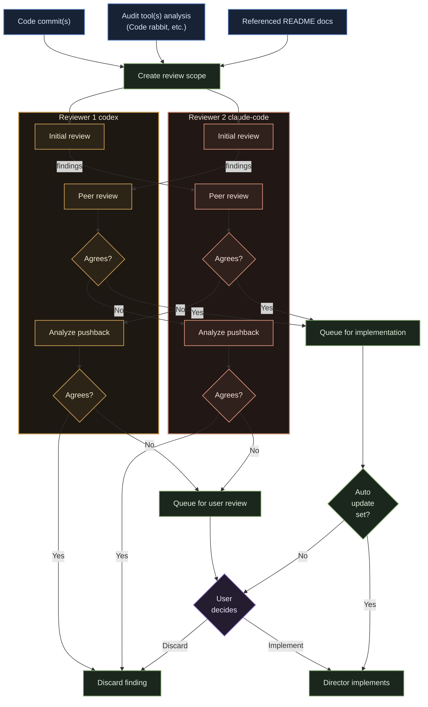

# Roboreviewer

Roboreviewer is a command-line tool for running a small, structured AI review board inside a git repository.

Instead of asking one coding agent to both review and implement changes on its own, Roboreviewer coordinates:

- one **Director** agent, which can review and implement changes
- an optional second **Reviewer** agent, which can provide a second set of feedback
- optional audit tools such as **CodeRabbit**, which supplies extra advisory context

## Workflow



## What Problem It Solves

AI coding tools are fast, but they are not naturally disciplined. They can miss project rules, overconfidently suggest weak changes, or implement fixes without a clear review trail.

Roboreviewer adds structure around that process. It decides what code is being reviewed, loads the project context, asks agents to review the same target, tracks where they agree or disagree, auto-resolves the human decision points that require confirmation, and applies the approved fixes in one implementation pass.
That automation is now configurable: you can keep automatic consensus updates on, or require a per-finding approval before the Director changes code.

## How It Works

Roboreviewer has two phases.

**Phase 1: Review and consensus handling**

You point it at a commit range or just the latest commit. It gathers the diff, optionally loads project docs, optionally runs an audit tool, and asks the configured agents to review the same change set. Accepted findings are either implemented automatically by the Director or held for a per-item `y/n` approval, depending on `autoUpdate`.

**Phase 2: Re-scan or finish**

If reviewers disagree and the disagreement survives pushback, Roboreviewer asks you to resolve those non-consensus items immediately inside the same review run. The Director then implements the approved consensus and approved non-consensus items together.

After that review iteration is complete, Roboreviewer prompts only for:

- re-scan after the last changes
- end the review

Repeat scans reuse the original commit scope and add current unstaged and untracked workspace changes. Previously tracked findings are not reopened just because they still exist in that wider scope.

That means most of the flow is non-interactive, but the edge cases stay explicit and auditable.

## Typical Workflow

In practice, the experience is meant to feel like this:

1. Initialize the repository once with `roboreviewer init`.
2. Run `roboreviewer review --last` or `roboreviewer review <commit-ish>`.
3. Let the tool review the target, confirm any disputed findings that need user input, and apply the approved changes.
4. Choose whether to re-scan after the last changes or end the review.
5. If that in-flight resolution step gets interrupted, run `roboreviewer resolve` or `roboreviewer resume`.

## Current Scope

This repository currently implements the v1 command set:

- `roboreviewer init`
- `roboreviewer review <commit-ish>`
- `roboreviewer review --last`
- `roboreviewer resolve`
- `roboreviewer resume`

Supported agent adapters in this build:

- `codex`
- `claude-code`
- `mock`

Supported built-in audit tool:

- `coderabbit`

In the current implementation, CodeRabbit is advisory input only. Its output is passed to reviewers as context, but it does not become a first-class Roboreviewer finding on its own.
Its output is still persisted and reported separately so audit feedback does not disappear just because no reviewer adopted it.

## What Gets Written

Roboreviewer keeps two kinds of files inside the target repository.

**Committed configuration**

```text
.roboreviewer/config.json
```

This describes which tools are enabled and where optional project documentation should be loaded from.
It also includes `autoUpdate`, which controls whether consensus findings are implemented automatically or require per-item approval.

**Runtime state**

```text
.roboreviewer/runtime/session.json
.roboreviewer/runtime/ROBOREVIEWER_SUMMARY.md
```

These files capture the current session, final decisions, and the human-readable summary of the run. The runtime directory should not be committed.
Each finding in `session.json` records its scan-iteration-based ID such as `f-1001`, `f-2001`, and so on, along with disposition metadata including `resolution_status`, `roboreview_outcome`, `decided_by`, and `user_approved`.

## Safety Model

Roboreviewer is intentionally conservative in v1.

- It requires a clean working tree before a review run starts.
- Repeat scans are the exception: they intentionally include the original commit scope plus current unstaged and untracked changes.
- It does not create branches automatically.
- It does not create commits automatically.
- It is designed to preserve resumable state when the human resolution flow is interrupted.

## Installing And Running It

If you are working directly from this repository, the easiest setup is:

```bash
npm link
roboreviewer init
```

If you do not want to link it globally, you can run it directly:

```bash
node --experimental-strip-types ./bin/roboreviewer.ts init
```

Inside a target repository, the normal first run is:

```bash
roboreviewer init
roboreviewer review --last
```

## Adapter Requirements

To use live agent adapters, the corresponding CLIs need to already exist and be authenticated on your machine.

`codex`

- `codex` CLI installed
- usable in non-interactive mode

`claude-code`

- `claude` CLI installed
- usable in `--print` mode

`coderabbit`

- `coderabbit` CLI installed if enabled in config

The `mock` adapter exists so the full workflow can still run end to end in a deterministic way during development and testing.

## Tests

Default test suite:

```bash
npm test
```

This exercises the deterministic mock workflow end to end.

Optional live adapter smoke tests:

```bash
npm run test:live:codex
npm run test:live:claude
npm run test:live:all
```

These are opt-in because they depend on local credentials, installed CLIs, and networked model access.

Linting:

```bash
npm run lint
```

Type checking:

```bash
npm run typecheck
```

Combined local verification:

```bash
npm run ci
```

## Packaging

This repository is already shaped like an npm CLI package through the `bin` entry in `package.json`.

That means:

- you can use it locally today via `npm link`
- it can be published later to npm
- after publishing, users will be able to run it through `npx`

This project is licensed under MIT.
