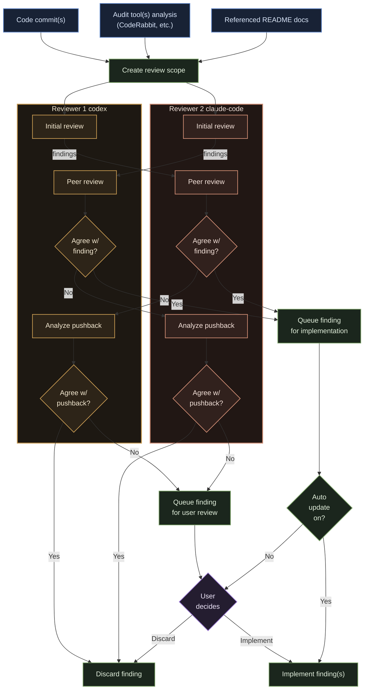
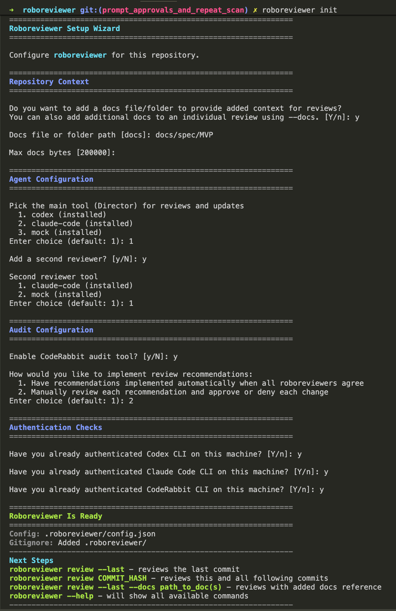

# roboreviewer

`roboreviewer` is an automated code reviewer CLI that marshals numerous other CLI tools into one coordinated workflow for AI assisted reviews.

Instead of manually interacting with several different AI tools for verifying code quality, `roboreviewer` captures, cross-references, validates and implements feedback across numerous tools.

## How it works

`roboreviewer`:

- Collects findings from static audit tools like CodeRabbit
- Feeds commits, audit tool findings and README docs to >=1 CLI coding agents for analysis
- Applies a peer-review consensus mechanism to agent findings to reinfoce feedback confidence.
- Provides the option to have recommendations updated automatically or after user approval.
- Requires user to tie-break findings that did not reach consensus across agents.
- Employs primary "Director" agent to automatically update code based on consensus and user feedback.
- Allows repeat smart scans to prevent issues from falling through the cracks.

---



## Setup Instructions

Follow [these instructions](docs/setup-instructions.md) to set up `roboreviewer` on your local machine.

## Commands

| Command                            | Purpose                                                                        |
| ---------------------------------- | ------------------------------------------------------------------------------ |
| `roboreviewer init`                | Initialize repository-specific `roboreviewer` configuration.                   |
| `roboreviewer review --last`       | Review the latest commit.                                                      |
| `roboreviewer review <commit-ish>` | Review a commit range from the included commit hash to the most recent commit. |
| `roboreviewer resume`              | Resume any paused review session from saved state.                             |

## Available CLI Tools

Supported agent adapters in this build:

- `codex`
- `claude-code`
- `mock`

Supported built-in audit tool:

- `coderabbit`

Any tools not already installed will be installed automatically if enabled during `roboreview init`.

## `roboreviewer init`

Running `roboreviewer init` triggers the init setup wizard for each repository:

  <div style="max-width: 700px; border: 1px solid #555; border-radius:8px; overflow:hidden;">
    
  </div>

<br/>

and produces `.roboreviewer/config.json`

```json
{
  "schema_version": 1,
  "autoUpdate": false,
  "agents": {
    "director": {
      "tool": "codex"
    },
    "reviewers": [
      {
        "tool": "claude-code"
      }
    ]
  },
  "audit_tools": [
    {
      "id": "coderabbit",
      "enabled": true
    }
  ],
  "context": {
    "docs_path": "docs/spec/MVP",
    "max_docs_bytes": 200000
  }
}
```

Running `roboreview init` a second time requires confirmation to overwrite file with new configuration.

## `roboreviewer review`

Running `roboreviewer` triggers a review workflow

[EXAMPLE REVIEW CLI SCREENSHOTS PLACEHOLDER - coming soon]

and produces `.roboreviewer/runtime/session.json`

[EXAMPLE REVIEW session.json PLACEHOLDER - coming soon]

## License

This project is licensed under MIT.
