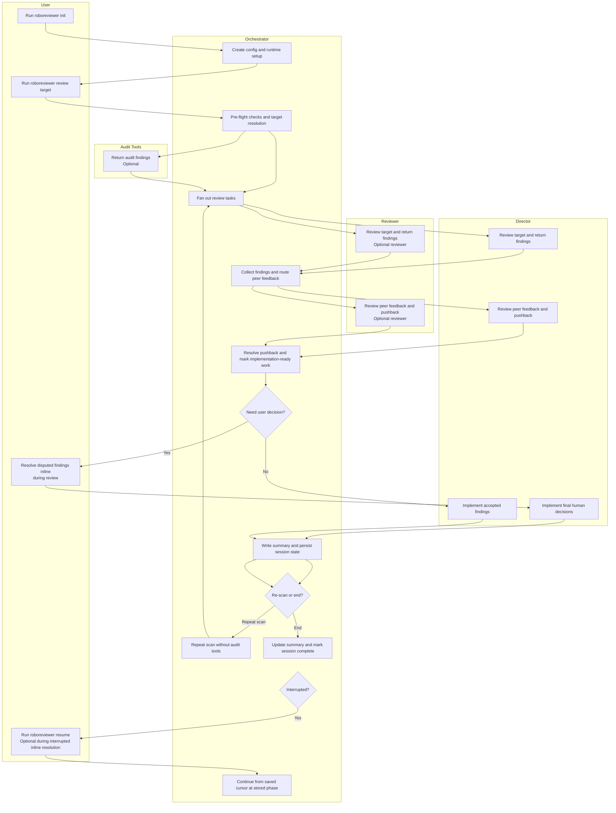
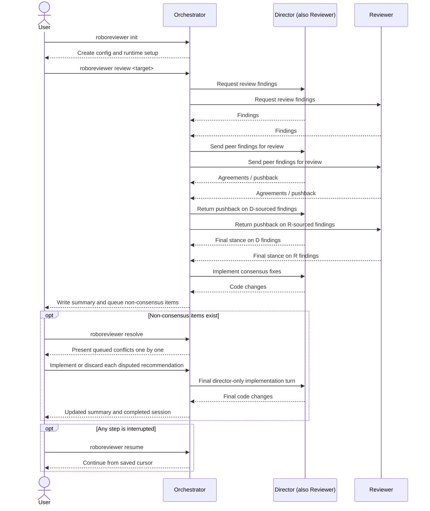

# PRD: Roboreviewer

**"The Multi-Agent Synthetic Review Board"**

## 1. Executive Summary & Problem Statement

### The Problem

AI coding tools can produce useful code changes quickly, but they do not reliably follow project-specific rules, documentation, or review standards without additional structure. Coordinating review across multiple tools is possible today, but it is mostly a manual workflow with inconsistent process and weak traceability.

### The Solution

**Roboreviewer** is a repository-scoped CLI that coordinates one implementation agent, an optional second review agent, and optional audit tools. It resolves the review target, loads relevant context, runs the review workflow, tracks disagreements, and persists state so the process can be resumed and audited.

### Product Goal

Build a reliable CLI for structured multi-agent code review and implementation with deterministic workflow ordering, safe git handling, resumable state, and explicit human decision points where needed.

---

## 2. Workflow Overview

The system has two main phases:

1. A review iteration that collects findings, asks for any required user decisions inline, and then performs one combined implementation pass.
2. A post-iteration loop where the user can repeat the scan or end the session.



---

## 3. Commands and Execution Model

| Command                             | Purpose                                                                                                                                               |
| ----------------------------------- | ----------------------------------------------------------------------------------------------------------------------------------------------------- |
| `roboreviewer init`                | Perform one-time repository setup and create `.roboreviewer/config.json`.                                                                            |
| `roboreviewer review <commit-ish>` | Run the review loop for the specified commit range, collect inline user decisions if needed, implement the approved findings, then prompt to re-scan or end. |
| `roboreviewer review --last`       | Run the same review loop for the most recent commit only.                                                                                                  |
| `roboreviewer resolve`             | Resume an interrupted inline non-consensus resolution or final implementation step from the current session.                                             |
| `roboreviewer resume`              | Alias for continuing an interrupted resolution workflow from persisted state.                                                                              |

Operational expectations:

- The automated review loop will avoid destructive git operations.
- Summary output and persisted state will remain consistent throughout execution.
- The repository must start from a clean working tree before the initial `roboreviewer review` begins.
- Repeat scans may include unstaged and untracked workspace changes.

## 4. Workflow

### 4.1 Roles and Operating Modes

1. The system will support exactly one Director, who is always part of the effective reviewer set, with zero or one additional Reviewer in v1.
1. The minimum supported configuration is a single-agent mode where the Director is also the only reviewer.
1. The Director is the sole agent responsible for implementing code changes based on feedback.

### 4.2 Review Target Modes

1. The system will support one review target mode in v1:
   - Commit range mode via `roboreviewer review <commit-ish>`
   - Last-commit shorthand via `roboreviewer review --last`
1. Commit mode will include the start commit and use deterministic ordering.
1. The resolved review target for v1 will be the combined code changes from the specified start commit through `HEAD`.
1. `roboreviewer review --last` will review only the most recent commit.
1. Full-codebase review and related chunking behavior are deferred to a future phase.

### 4.3 Audit Tools

1. The v1 workflow may run without any audit tools enabled.
1. `roboreviewer init` will present a list of preset built-in audit-tool options.
   - In v1, CodeRabbit is the only built-in audit-tool option.
   - The configuration shape should allow additional built-in audit tools to be added in a future phase.
1. Built-in audit tools will remain optional and individually enableable.
1. Built-in audit tools will be configured in `.roboreviewer/config.json` under `audit_tools`, which allows zero or more enabled built-in auditors.
1. Built-in audit tools will use preset configuration so the user only needs to decide whether to enable or disable each tool.
   - In v1, the built-in CodeRabbit integration should invoke the CodeRabbit CLI using its default review behavior and default configuration discovery unless Roboreviewer adds explicit support for overrides in a future phase.
1. If a selected built-in audit tool CLI is not installed, Roboreviewer will detect that during initialization or pre-flight checks and fail fast with clear installation guidance.
1. Audit-tool feedback will be provided to reviewers for consideration during review.
   - In v1, built-in audit output is passed to reviewers as simple advisory context rather than converted into first-class Roboreviewer findings.
   - Each reviewer may incorporate or disregard the audit feedback in their own findings.
   - Audit-tool findings are advisory input only in v1 and do not become first-class findings unless a reviewer adopts them.
   - Audit-tool findings are not directly part of the reviewer pushback workflow.

### 4.4 Initial and Peer Review

1. Each configured reviewer will analyze the same resolved review target and produce findings with stable attribution metadata.
   - In v1, each finding should include a summary, recommendation, severity, and location.
1. When a second reviewer is configured, the Director and Reviewer will peer-review each other's findings.
1. Reviewers will not peer-review their own findings.

### 4.5 Disputes

1. When a second reviewer is configured,
   - peer-review pushback will be routed back to the original source reviewer.
   - the source reviewer will record whether the finding is withdrawn.
   - Findings that remain disputed after pushback resolution will be added to a non-consensus queue.
1. Every finding, peer-review comment, and pushback decision will retain stable reviewer attribution metadata.

### 4.6 Resolution - Consensus Items

1. Findings accepted without pushback, including all findings in single-agent mode, will be treated as implementation-ready.
1. `.roboreviewer/config.json` will include a top-level `autoUpdate` boolean.
1. When `autoUpdate` is `true`, review-consensus findings will be implemented without a per-item approval prompt and `user_approved` will remain `null`.
1. When `autoUpdate` is `false`, each review-consensus finding will be presented to the user for approval before implementation.
1. When `autoUpdate` is `false`, each review-consensus finding will persist `user_approved: true` or `user_approved: false`, and only `true` findings will be implemented.
1. Rejected consensus findings will remain tracked in session state but will not be reintroduced in later repeat scans.

### 4.7 Resolution - Non-Consensus Items

1. Non-consensus items will be presented through a guided interactive decision flow inside the main `roboreviewer review` command before the Director implements any accepted findings.
1. The resolution flow will present one queued item at a time with the finding summary, reviewer positions, relevant context, and the available decision options `Implement Disputed Recommendation` and `Discard Disputed Recommendation`.
1. User decisions will be persisted after each step so the workflow can resume safely after interruption.
1. After user decisions are collected, the Director will perform one implementation turn that applies both the approved review-consensus findings and the approved non-consensus findings together, without reopening another peer-review cycle.
1. HITL decisions will survive restart and crash, and `roboreviewer resume` will continue an interrupted resolution workflow from persisted state, including the final Director implementation turn if decisions were already recorded.
1. Broad automated-loop resume behavior is deferred to a future phase.
1. The final Director-only turn will be correct and idempotent.

### 4.8 Repeat Scan

1. After each review iteration, the CLI will prompt the user to:
   - repeat the scan
   - end the scan
1. Repeat scans will skip all audit tools, even if they were enabled for the initial scan.
1. Repeat scans will use the original committed review scope plus current unstaged and untracked workspace changes.
1. Repeat scans will not require a clean working tree.
1. Repeat scans will ignore findings that were already tracked in earlier iterations, including previously discarded or rejected items.
1. New findings discovered during repeat scans will be appended to `session.json`.
1. Reviewer findings will persist explicit disposition metadata:
   - `resolution_status`
   - `roboreview_outcome`
   - `decided_by`
   - `user_approved`
1. Finding IDs will be namespaced by scan iteration:
   - first scan: `f-1001+`
   - second scan: `f-2001+`
   - third scan: `f-3001+`

## 5. Configuration and Initialization

All repository-local settings will live in `.roboreviewer/config.json`.

**Repository layout:**

```text
your-project/
  .roboreviewer/
    config.json          # Commit this
    runtime/             # Gitignore this whole directory
  src/
  docs/
```

**Configuration structure:**

```json
{
  "schema_version": 2,
  "autoUpdate": true,
  "agents": {
    "director": {
      "tool": "claude-code"
    },
    "reviewers": [
      {
        "tool": "codex"
      }
    ]
  },
  "audit_tools": [
    {
      "id": "coderabbit",
      "enabled": true
    }
  ],
  "context": {
    "docs_path": "docs/requirements",
    "max_docs_bytes": 200000
  },
  "runtime": {
    "deterministic": true,
    "max_retries": 3
  }
}
```

`agents.director` defines the implementation agent and also implicitly adds that tool to the reviewer set.  
`agents.reviewers` should contain only the optional second reviewer beyond the Director.

`audit_tools` contains optional built-in audit-tool integrations configured by reserved IDs such as `coderabbit`.

`context.docs_path` is an optional repository-local documentation folder for this specific project and the only configured docs source in v1.
`context.max_docs_bytes` defines the maximum total size of documentation loaded from either `context.docs_path` or an overriding `--docs <path>`.

**Initialization behavior:**

```bash
roboreviewer init
```

`roboreviewer init` will:

1. Prompt for an optional repository-local docs path.
2. Prompt for a documentation-size limit.
3. Prompt for Director and optional second-reviewer role selection.
4. Prompt for enabling or disabling supported built-in audit tools such as CodeRabbit.
5. Create `.roboreviewer/config.json` with sensible defaults plus the supplied paths, role selections, and audit-tool selections.
6. Ask whether to add `.roboreviewer/runtime/` to `.gitignore`, with an option to do it automatically.

Before `roboreviewer review` or `roboreviewer resolve` begins work, the system will validate that the config satisfies the minimum schema and runtime requirements. Validation in v1 is technical only, such as config shape, git state, path existence, and byte limits. It will not attempt to validate whether documentation fully captures project-specific business rules.

`roboreviewer init` should launch an interactive setup wizard inside the terminal rather than rely on ad hoc prompts alone, but the product should remain command-based rather than depend on a general-purpose REPL.

Non-interactive initialization is out of scope for v1 and may be added in a future phase.

**What to commit:**

- ✅ `.roboreviewer/config.json`
- ❌ `.roboreviewer/runtime/`

---

## 6. Instruction and Documentation Context

1. Roboreviewer should prefer each agent's native instruction-file discovery behavior when that behavior is already supported by the underlying tool.
2. Relevant native rule sources may include:
   - `~/.claude/CLAUDE.md` when supported by the tool
   - `AGENTS.md` or `CLAUDE.md` at the project root or in relevant subdirectories
   - `.claude/rules/*.md` for Claude-compatible tools
3. Roboreviewer should not duplicate or override native rule discovery unless two tools would otherwise receive meaningfully different instruction context for the same review target.
4. When native behavior diverges across tools, the orchestrator may add a small normalized context block that clarifies which discovered rule files apply and what precedence order should be followed.
5. Optional product or requirements documentation should be loaded from the configured docs path and may be overridden per run via `--docs <path>`.
6. Whether documentation is loaded from `context.docs_path` or from `--docs <path>`, Roboreviewer will recursively load `.md` and `.txt` files, measure the total selected file size, and fail fast with a clear error if the payload exceeds `context.max_docs_bytes`.
7. When `--docs <path>` is provided, it completely overrides `context.docs_path` for that run.
8. For commit-range review in v1, the primary review payload sent to agents will be the unified diff for the combined changes from the selected start commit through `HEAD`.
9. The orchestrator may include a small amount of surrounding metadata with that diff, such as the resolved commit list and changed file paths, but the review contract is diff-first rather than full-file or full-repository analysis.

---

## 7. Performance SLOs

Performance targets are deferred to a future phase. The first iteration should optimize for correctness, safe execution, and a clear user workflow.

---

## 8. Implementation Gap Analysis & Resolution

Detailed implementation gaps beyond the MVP scope are deferred to a future phase. The first iteration should focus on clear command behavior, safe git handling, and the core consensus workflow.

---

## 9. Token Efficiency & Cost Control

Token-efficiency and cost-optimization features are deferred to a future phase.

---

## 10. Reporting: `.roboreviewer/runtime/ROBOREVIEWER_SUMMARY.md`

This document is updated every iteration and serves as the session's human-readable source of truth.

- **Unresolved Conflicts:** Queued items awaiting human decisions
- **Consensus Fixes:** Changes implemented based on reviewer consensus
- **Review Log:** Summary of reviewer findings and their resolution status
- **Session Stats:** Basic execution metadata for the session

---

## 11. Future Extensions

See [`docs/future_phase/deferred-scope.md`](/Users/kirinmurphy/projects/prototypin/consensus_reviewers/docs/future_phase/deferred-scope.md) for deferred capabilities beyond the first iteration.

---

## 12. Glossary

### Roles and Agents

| Term             | Definition                                                                                                         |
| ---------------- | ------------------------------------------------------------------------------------------------------------------ |
| **Director**     | The AI agent with write access that implements code changes and always participates in the effective reviewer set. |
| **Reviewer**     | An additional AI agent, typically read-only, that analyzes code and critiques findings.                            |
| **Orchestrator** | The control system that coordinates agents, state, and workflow transitions.                                       |
| **Adapter**      | Integration layer that connects Roboreviewer to a specific tool such as a Director Adapter or Reviewer Adapter.   |

### Review Process

| Term                         | Definition                                                                                               |
| ---------------------------- | -------------------------------------------------------------------------------------------------------- |
| **Finding**                  | A single code issue identified by a reviewer.                                                            |
| **Merged Finding**           | A consolidated finding representing the same issue identified by both reviewers, with attribution retained for both tools. |
| **Peer Review**              | When one reviewer evaluates another reviewer's findings.                                                 |
| **Pushback**                 | A reviewer's disagreement with another reviewer's finding.                                               |
| **Non-consensus**            | A finding that remains disputed after pushback resolution and is queued for human decision.              |
| **HITL (Human-in-the-Loop)** | The interactive resolution flow where the user either implements or discards queued non-consensus items. |

### State and Outputs

| Term                         | Definition                                                                          |
| ---------------------------- | ----------------------------------------------------------------------------------- |
| **Session State**            | Persisted runtime state stored in `.roboreviewer/runtime/session.json`.            |
| **Cursor**                   | Pointer indicating the current phase and next pending item in a resumable workflow. |
| **ROBOREVIEWER_SUMMARY.md** | Human-readable runtime report stored in `.roboreviewer/runtime/`.                  |
| **Review Log**               | Summary of reviewer findings plus their resolution status.                          |

---

## 13. Appendix

### 13.1 Detailed Workflow Sequence


