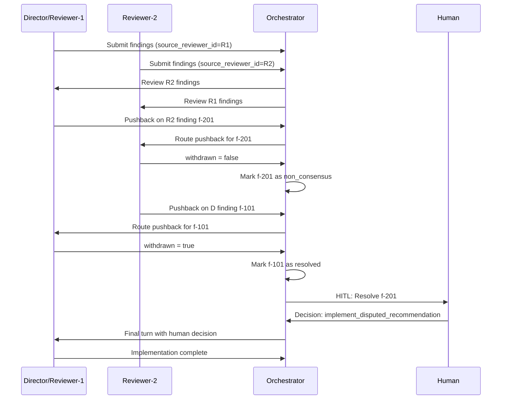

# Technical Reference: Roboreviewer

This document explains how Roboreviewer works under the hood: the architecture, data flow, and integration patterns that support both single-agent review and v1 two-agent consensus review.

---

## 1. System Overview

### 1.1 Architecture

The Orchestrator is a **stateful controller** that coordinates three types of **stateless adapters** in the first iteration:

1. **Director Adapter** - Connects to the implementation agent (e.g., Claude Code) with write access
2. **Reviewer Adapter** - Connects to review agents (e.g., Codex) in read-only mode
3. **Built-in Audit Adapter** - Connects to preset automated tools (e.g., CodeRabbit) for baseline code analysis

The controller manages state, routes findings between agents, and ensures deterministic workflow ordering.

### 1.2 Core Principles

1. **Deterministic Execution** - Same inputs produce the same workflow ordering
2. **Atomic State Persistence** - State is always consistent, even after crashes
3. **Safe Git Operations** - No destructive operations and no automated branch or commit management in the first iteration
4. **Prompt Redaction** - Secrets are masked before being sent to any agent

---

## 2. How the System Works

### 2.1 Execution Flow

```
1. Pre-flight Checks
   ↓
2. Review Target Resolution (what code to review)
   ↓
3. Context Assembly (rules, docs, configuration)
   ↓
4. Optional Built-in Audit Phase
   ↓
5. Initial Review Phase (the Director and optional second reviewer analyze code)
   ↓
6. Optional Peer Review Phase (only when a second reviewer exists)
   ↓
7. Optional Pushback Resolution (only when a second reviewer exists)
   ↓
8. Determine implementation-ready findings and unresolved conflicts
   ↓
9. Implementation Phase (Director applies accepted findings)
   ↓
10. HITL Resolution Queue Finalization (aggregate unresolved items for human review)
   ↓
11. Reporting (generate .roboreviewer/runtime/ROBOREVIEWER_SUMMARY.md)
```

### 2.2 Execution Modes

**Non-Interactive (Default):**
The `roboreviewer review` command runs the full automated review loop without user interaction:

- Runs to completion automatically
- Suitable for automation, CI/CD, and scripts
- Outputs `.roboreviewer/runtime/ROBOREVIEWER_SUMMARY.md` with results
- Exits after consensus findings are implemented and unresolved conflicts are queued

**Interactive (HITL):**
The `roboreviewer resolve` command enters Human-in-the-Loop mode:

- User is prompted for each queued non-consensus conflict from a completed review run
- Session state is saved between decisions
- Can exit and `roboreviewer resume` later, including after decisions are recorded but before the final Director implementation turn completes
- Provides context (reviewer's critique, director's pushback, relevant rules/docs)

## 3. Key Subsystems

### 3.1 Initialization & Pre-flight Checks

#### The `roboreviewer init` Command

Before using Roboreviewer in a repository for the first time, run:

```bash
roboreviewer init
```

This creates `.roboreviewer/config.json` with:

1. Prompts for a repository-local `docs_path` (or leaves it empty if not needed)
2. Prompts for a documentation-size limit
3. Prompts for Director and optional second-reviewer agent choices
4. Prompts for enabling supported built-in audit tools
5. Prompts the user to add `.roboreviewer/runtime/` to `.gitignore` or does it automatically if approved

**One-time setup per repository.** The config file should be committed so the whole team shares the same settings.

#### Pre-flight Checks ("The Doctor")

Before any `roboreviewer review` command runs, the system validates the environment:

**Binary Verification:**

- Checks `$PATH` for `claude` and `codex`
- Runs `[tool] --version` to verify compatibility
- Looks for headless execution support in the configured tools
- If CodeRabbit is enabled, verifies the CodeRabbit CLI is installed and can run with its default review configuration

**Configuration Check:**

- Verifies `.roboreviewer/config.json` exists (prompts to run `roboreviewer init` if missing)
- Validates config schema version
- Validates documentation settings including optional `context.docs_path` and `context.max_docs_bytes`
- Validates built-in audit-tool selections
- Validation is technical only in v1, such as config shape, path existence, and byte limits

**Git Integrity:**

- Verifies current directory is a Git repository
- Ensures working tree is clean
- Confirms no detached HEAD state

**Fail-Fast:** If any required capability is missing, the tool exits with a clear error message before doing any work.

---

### 3.2 Review Target Resolver

#### 3.2.1 Commit Range Mode

**Command:** `roboreviewer review <commit-ish>`

**How it works:**

```bash
# Verify the commit exists
git rev-parse --verify <commit-ish>

# Ensure it's an ancestor of HEAD
git merge-base --is-ancestor <commit-ish> HEAD

# Get all commits from start to HEAD (includes the specified commit)
git rev-list --reverse <commit-ish>^..HEAD
```

**Result:** A deterministic list of commits to review, always in the same order.

For the first iteration, the effective review target passed to agents is the unified diff covering the specified start commit through `HEAD`.
The orchestrator may also include lightweight metadata such as the resolved commit list, commit messages, and changed file paths, but v1 review remains diff-first rather than full-file analysis.

#### 3.2.2 Last Commit Shorthand

**Command:** `roboreviewer review --last`

For the first iteration, `--last` is shorthand for reviewing only the current `HEAD` commit.

---

### 3.3 Rule Aggregation & Context Assembly

The system should prefer native instruction-file discovery in each adapter, then add only the minimal normalization needed for cross-tool consistency.

#### Rule Sources (for normalization when relevant)

For **Claude as Director:**

1. `.claude/rules/*.md` (highest priority - domain-specific)
2. `./AGENTS.md` or `./CLAUDE.md` (project standards)
3. `~/.claude/CLAUDE.md` (global preferences)

For **Codex as Director:**

1. `./AGENTS.md` (highest priority - project standards)
2. `.claude/rules/*.md` (domain-specific)
3. `~/.claude/CLAUDE.md` (global preferences)

The orchestrator should not duplicate this behavior unless an adapter cannot rely on native discovery or unless it needs to pass explicit precedence notes so different tools receive equivalent guidance.

#### Documentation Injection

If `context.docs_path` is configured, documentation is loaded from that path:

1. Recursively read `.md` and `.txt` files from that path
2. Wrap content in `<documentation>` tags
3. Exclude secret patterns from docs directory
4. Use deterministic ordering (sorted paths)
5. Measure the total selected file size before prompt assembly
6. Fail fast with a clear error if the selected docs exceed `context.max_docs_bytes`

If no docs path is configured, the review can still proceed without injected project documentation.

The path can be overridden for a single run via `--docs <path>`, which replaces `context.docs_path` for that run but still uses `context.max_docs_bytes` as the size limit.

**Why wrap in tags?** Prevents agents from confusing requirements (in docs) with implementation instructions (in rules).

#### Prompt Redaction

Before sending prompts to any agent:

1. Detect and mask obvious secret tokens (API keys, passwords)
2. Apply redaction to code snippets and tool output
3. Record redaction event counts in session metadata (without storing the secrets themselves)

#### Configuration: `.roboreviewer/config.json`

This file lives in each repository (not in the CLI tool). It should be committed to version control so the entire team uses the same settings.

For the first iteration, audit-tool configuration is limited to built-in preset integrations. Custom audit commands and custom contracts are deferred.
Built-in audit tools are configured under `audit_tools`, which allows zero or more enabled preset auditors such as `coderabbit`.
When `coderabbit` is enabled, the adapter invokes the CodeRabbit CLI in its default review mode and relies on the CLI's native configuration and auth discovery rather than adding a Roboreviewer-specific contract in v1.

---

### 3.4 Consensus Engine

This subsystem handles both single-agent review and v1 two-agent consensus review.

#### Data Structure: The Finding

Each code issue discovered by a reviewer is represented as a finding:

```json
{
  "finding_id": "f-001",
  "source_reviewer_id": "reviewer-2",
  "category": "correctness|security|style|performance",
  "severity": "low|medium|high",
  "location": { "file": "src/auth.ts", "line": 42 },
  "summary": "Authentication logic bypasses rate limiting",
  "recommendation": "Add rate-limit enforcement before password verification",
  "status": "open|resolved|non_consensus",
  "peer_reviews": [
    {
      "peer_reviewer_id": "reviewer-1",
      "stance": "agree|pushback",
      "note": "This is actually handled in middleware layer"
    }
  ],
  "pushback_resolution": {
    "responded_by": "reviewer-2",
    "withdrawn": true,
    "note": "You're right, I missed the middleware check"
  }
}
```

#### Review Flow

**1. Initial Review:**

- If built-in audit tools are enabled, their output is collected before reviewer fanout and passed to reviewers as simple advisory context
- All reviewers (including Director-as-reviewer) analyze the code
- Each generates their own findings with unique `finding_id` and `source_reviewer_id`
- Built-in audit feedback is advisory input only in v1 and becomes part of the review only when a reviewer adopts it as a finding

**2. Peer Review Stage (two-agent mode only):**

- The Director and optional second reviewer exchange findings
- They can `agree` or generate `pushback` with reasoning
- **Self-review prevention:** Reviewers cannot review their own findings (`peer_reviewer_id != source_reviewer_id`)
- Peer review runs once both reviewers have submitted their findings for the commit-range target

**3. Pushback Routing (two-agent mode only):**

- Pushback is routed back to `source_reviewer_id` (the original author of the finding)
- Original reviewer records whether the finding is withdrawn:
  - `withdrawn = true` → finding status becomes `resolved`
  - `withdrawn = false` → finding status becomes `non_consensus`

**4. Single-Agent Mode:**

- If only the Director is configured, findings skip peer review and pushback entirely
- Director-authored findings are treated as implementation-ready unless filtered out by policy or validation

**5. Implementation-ready rule in v1:**

- In two-agent mode, a finding is implementation-ready only if the peer reviewer agrees or if no pushback is raised
- If pushback is raised and the source reviewer keeps the finding (`withdrawn = false`), the finding becomes `non_consensus`
- If pushback is raised and the source reviewer withdraws the finding (`withdrawn = true`), the finding becomes `resolved` and is not implemented

**6. Deduplication:**

- If both reviewers identify the same issue, the peer review stage may label the findings as duplicates and request consolidation
- Consolidation produces a single merged finding tracked by one canonical `finding_id`
- The merged finding retains attribution for both contributing reviewers and preserves both original recommendation texts as supporting context when they differ
- After consolidation, peer review and HITL operate on the merged finding rather than on the original duplicate entries
- For v1, the orchestrator does not attempt semantic deduplication before peer review; duplicate detection is driven by reviewer labeling during the peer review phase

#### Why This Works

- **Peer accountability:** Reviewers can't just throw out critiques without defending them
- **Distributed authority:** No single agent is "right" by default
- **Human escalation:** Non-consensus items go to the human for final decision

---

### 3.5 HITL (Human-in-the-Loop) Resolver

When the consensus engine produces non-consensus items, they are added to a deferred resolution queue. The human resolves that queue after the review loop has completed, or later via `roboreviewer resolve`.

#### Interactive UI

For each unresolved conflict, the user sees:

```
? [Conflict 1/3]: Reviewer (Codex) wants to refactor 'Auth.ts' to use a Reducer.
  Director (Claude) says it's overkill for 2 state variables.

  What is your decision?
  > [1] Implement Disputed Recommendation
  > [2] Discard Disputed Recommendation
```

#### Decision Options

1. **Implement Disputed Recommendation** - Mark the disputed finding for implementation in the final Director turn
2. **Discard Disputed Recommendation** - Close the disputed finding without implementation

#### Session Resumption

State is saved in `.roboreviewer/runtime/session.json` with cursor tracking:

```json
{
  "cursor": {
    "phase": "hitl_resolution",
    "next_conflict_index": 2,
    "decisions": [
      { "conflict_id": "c-001", "decision": "implement_disputed_recommendation" },
      { "conflict_id": "c-002", "decision": "discard_disputed_recommendation" }
    ]
  }
}
```

If the user exits during HITL, running `roboreviewer resume` picks up exactly where they left off.

For the first iteration, `roboreviewer resume` is only required to continue an interrupted HITL resolution flow, including the final Director implementation turn after decisions are recorded.

Resume in the HITL flow is phase-boundary based:

1. Persist state atomically after each HITL decision
2. Once all decisions are collected, persist a `final_implementation` cursor before invoking the Director
3. On resume, continue from the next unresolved conflict or rerun the pending final implementation step, depending on the stored cursor phase

---

### 3.6 Git Safety Model

The first iteration uses a minimal git safety model.

#### Working Tree Requirements

1. `roboreviewer review` requires a clean working tree before execution starts
2. The tool will fail fast if unstaged changes, staged changes, or untracked non-ignored files are present
3. Director changes are applied directly to the current checkout by the underlying tool
4. The tool does not create branches or automatic commits in the first iteration

**Forbidden Operations:**

- `git reset --hard`
- `git push --force`
- Automatic commits made by Roboreviewer

---

### 3.7 Adapter Interface

Director and Reviewer adapters implement the same interface:

#### Required Methods

1. **`healthcheck()`** - Verify the tool is available and responsive
2. **`probeCapabilities()`** - Check for JSON output, headless mode, etc.
3. **`execute(request)`** - Run the agent with a typed request such as `review`, `peer_review`, `pushback_response`, or `implement`
4. **`classifyError(error)`** - Determine if an error is retryable

#### Normalized Responses

Review-style requests (`review`, `peer_review`, `pushback_response`) return findings and comments, not code patches:

```json
{
  "status": "ok|error|partial",
  "findings": [
    {
      "finding_id": "f-001",
      "category": "correctness",
      "severity": "high",
      "location": { "file": "src/auth.ts", "line": 42 },
      "summary": "Authentication logic bypasses rate limiting",
      "recommendation": "Add rate-limit enforcement before password verification"
    }
  ],
  "comments": [],
  "usage": { "input_tokens": 1500, "output_tokens": 800 },
  "raw": "original tool output for debugging"
}
```

Implementation requests (`implement`) instruct the Director tool to edit the current checkout directly and report execution metadata rather than returning a patch for the orchestrator to apply:

```json
{
  "status": "ok|error|partial",
  "files_touched": ["src/auth.ts"],
  "usage": { "input_tokens": 1500, "output_tokens": 800 },
  "raw": "original tool output for debugging"
}
```

#### Headless Execution

To avoid interactive hangs:

- **Claude Adapter:** Uses headless/print mode
- **Codex Adapter:** Uses non-interactive execution settings

Output is captured as structured data where possible.

---

## 4. State Management

### 4.1 Session State: `.roboreviewer/runtime/session.json`

This file is the source of truth for the current roboreviewer session.

**Required fields:**

```json
{
  "schema_version": 1,
  "session_id": "2026-03-08T19-10-00Z",
  "status": "running|paused|complete",
  "review_target": {
    "mode": "commit_range",
    "selector": "a1b2c3d",
    "resolved_commit_count": 15
  },
  "iterations": [
    {
      "iteration_num": 1,
      "reviewer_findings_count": 8,
      "consensus_count": 6,
      "non_consensus_count": 2
    }
  ],
  "conflicts": [
    {
      "conflict_id": "c-001",
      "finding_id": "f-005",
      "status": "unresolved|resolved",
      "human_decision": "implement_disputed_recommendation|discard_disputed_recommendation|null"
    }
  ],
  "findings": [
    {
      "finding_id": "f-005",
      "merged_from": ["f-005", "f-101"],
      "attribution": ["reviewer-1", "reviewer-2"]
    }
  ],
  "cursor": {
    "phase": "hitl_resolution|final_implementation",
    "next_conflict_index": 0
  },
  "updated_at": "2026-03-08T19:10:12Z"
}
```

**Why `schema_version`?** Allows future migrations if state format changes.

**Atomic writes:** Always write to `.roboreviewer/runtime/session.tmp.json` then rename to prevent corruption on crash.

---

### 4.2 Reporting: `.roboreviewer/runtime/ROBOREVIEWER_SUMMARY.md`

Generated after each iteration, this is the human-readable report.

**Required sections:**

```markdown
# Debate Summary

## ⚠️ Unresolved Conflicts

1. **Auth.ts:42** - Reviewer wants Reducer pattern, Director says overkill
   - Reviewer (Codex): "State management should scale"
   - Director (Claude): "Only 2 variables, YAGNI principle"
   - Status: **Awaiting human decision**

## ✅ Consensus Fixes

1. **api.ts:15** - Added rate limiting (Reviewer-1, agreed by Director)
2. **db.ts:88** - Fixed SQL injection vulnerability (Reviewer-2, agreed by all)

## 📋 Review Log

- Built-in audit tools identified 12 baseline issues
- Reviewers identified 8 issues
- 15 findings after deduplication
- 13 resolved via consensus
- 2 escalated to human

## 📊 Session Stats

- Duration: 4m 32s
```

---

## 5. Error Handling & Reliability

### 5.1 Error Classification

Errors are classified as **retryable** or **terminal**:

**Retryable (with exponential backoff):**

- Timeout
- Transient tool unavailable

**Terminal (fail immediately):**

- Malformed output after one retry
- Git state errors
- Unsupported required capability

### 5.2 Retry Policy

```javascript
max_retries = 3 (from config)
backoff = [1s, 2s, 4s]

for attempt in 1..max_retries:
  try:
    result = execute()
    return result
  catch RetryableError:
    wait(backoff[attempt])
  catch TerminalError:
    exit_with_error()
```

## 6. Testing Requirements

### 6.1 Core Functionality Tests

1. **Deterministic range tests** - Same commit range always produces same file list
2. **Diff payload tests** - Same commit range always produces the same unified diff payload and metadata ordering
3. **Rule precedence tests** - Correct rules applied for Claude vs Codex Director
4. **Adapter capability/fallback tests** - Handles missing tools gracefully
5. **Clean-working-tree enforcement tests** - `roboreviewer review` refuses to run when the working tree is not clean
6. **Crash/restart persistence tests** - State is valid after interruption during `resolve`

### 6.2 Consensus Engine Tests

1. **Reviewer attribution integrity** - Every finding has correct `source_reviewer_id`
2. **Peer review attribution** - Peer reviews have correct `peer_reviewer_id`
3. **Pushback routing** - Pushback always returns to original source reviewer
4. **Self-review prevention** - Reviewers cannot review their own findings
5. **Peer-labeled deduplication correctness** - Same issue from both reviewers gets merged only after duplicate labeling in peer review
6. **Merged attribution integrity** - Consolidated findings retain attribution for both contributing reviewers

### 6.3 HITL Tests

1. **Interactive decision persistence** - Decisions survive restart
2. **Resume cursor correctness** - `roboreviewer resume` picks up at right conflict
3. **Final-turn idempotency** - Running final turn twice produces same result
4. **Summary/state consistency** - `.roboreviewer/runtime/session.json` and `.roboreviewer/runtime/ROBOREVIEWER_SUMMARY.md` always agree

---

## 7. Consensus Sequence Diagram



---

## 8. Implementation Strategy

While this is a unified system, development can proceed in layers:

**Foundation (M0):**

- Pre-flight checks
- Review target resolver
- Session state management
- Adapter interfaces
- Built-in audit adapter support

**Core Loop (M1):**

- Initial review collection
- Peer review stage
- Pushback routing
- Consensus determination
- HITL resolver
- Final implementation turn

**Polish (M2):**

- Multi-reviewer support (N > 2)
- Advanced deduplication
- Performance optimizations
