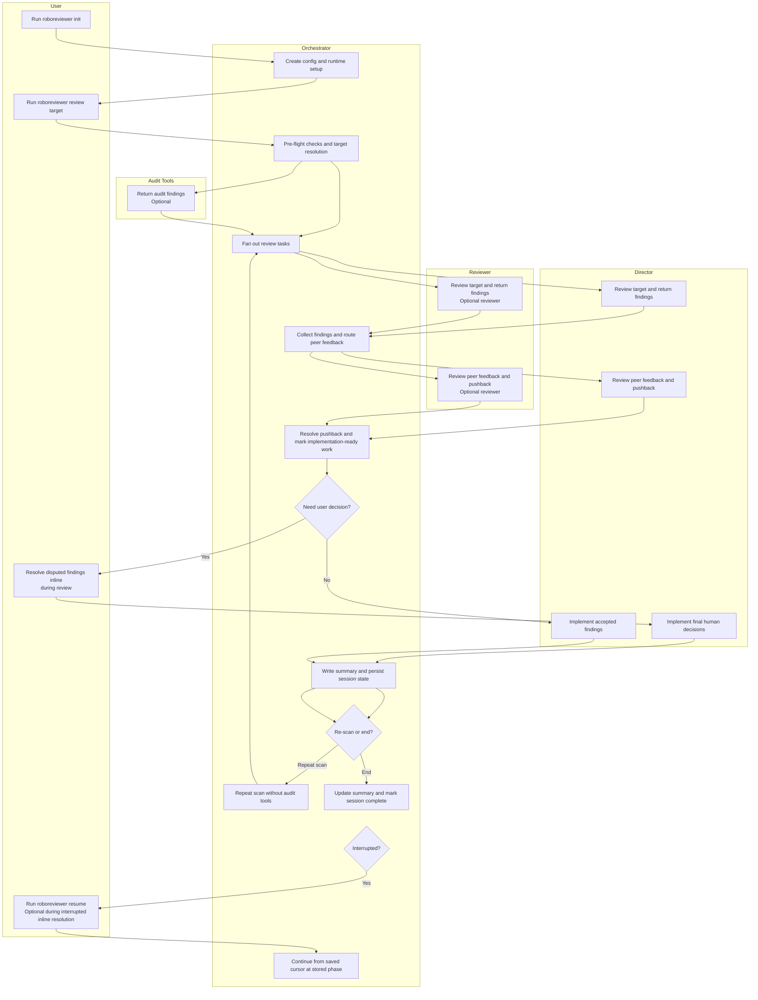
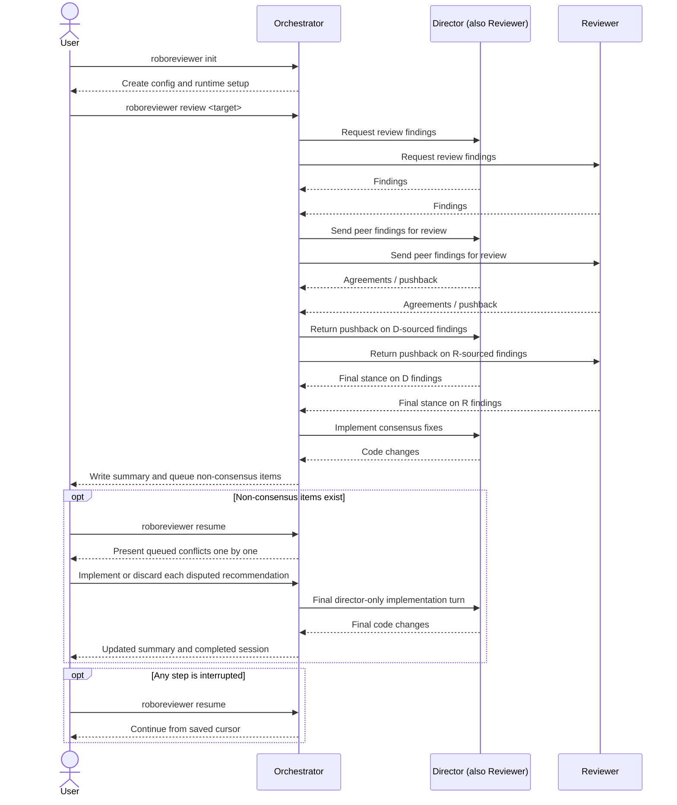

# PRD: Roboreviewer

**"The Multi-Agent Synthetic Review Board"**

## 1. Executive Summary & Problem Statement

### The Problem

AI coding tools can produce useful code changes quickly, but they do not reliably follow project-specific rules, documentation, or review standards without additional structure. Coordinating review across multiple tools is possible today, but it is mostly a manual workflow with inconsistent process and weak traceability.

### The Solution

**Roboreviewer** is a repository-scoped CLI that coordinates one implementation agent, an optional second review agent, and optional audit tools. It resolves the review target, loads relevant context, runs the review workflow, tracks disagreements, and persists state so the process can be resumed and audited.

### Product Goal

Build a reliable CLI for structured multi-agent code review and implementation with deterministic workflow ordering, safe git handling, resumable state, and explicit human decision points where needed.

This PRD is the authoritative MVP product document for the current repository build. Where earlier draft expectations conflicted with later implementation decisions, the current implemented behavior takes precedence.

---

## 2. Workflow Overview

The system has two main phases:

1. A review iteration that collects findings, asks for any required user decisions inline, and then performs one combined implementation pass.
2. A post-iteration loop where the user can repeat the scan or end the session.



---

## 3. Commands and Execution Model

| Command                            | Purpose                                                                   |
| ---------------------------------- | ------------------------------------------------------------------------- |
| `roboreviewer init`                | Perform one-time repository setup and create `.roboreviewer/config.json`. |
| `roboreviewer review <commit-ish>` | Run the review loop for the specified commit range                        |
| `roboreviewer review --last`       | Run the same review loop for the most recent commit only.                 |
| `roboreviewer resume`              | Resume any paused review workflow from the current session state.         |

Operational expectations:

- The automated review loop will avoid destructive git operations.
- Summary output and persisted state will remain consistent throughout execution.
- The repository must start from a clean working tree before the initial `roboreviewer review` begins.
- Repeat scans may include unstaged and untracked workspace changes.
- This repository build targets Node.js 22+ and runs directly from TypeScript source using Node's `--experimental-strip-types` support.

## 4. Workflow

### 4.1 Roles and Operating Modes

1. The system will support exactly one Director, who is always part of the effective reviewer set, with zero or one additional Reviewer in v1.
1. The minimum supported configuration is a single-agent mode where the Director is also the only reviewer.
1. The Director is the sole agent responsible for implementing code changes based on feedback.

### 4.2 Review Target Modes

1. The system will support one review target mode in v1:
   - Commit range mode via `roboreviewer review <commit-ish>`
   - Last-commit shorthand via `roboreviewer review --last`
1. Commit mode will include the start commit and use deterministic ordering.
1. The resolved review target for v1 will be the combined code changes from the specified start commit through `HEAD`.
1. `roboreviewer review --last` will review only the most recent commit.
1. Full-codebase review and related chunking behavior are deferred to a future phase.

### 4.3 Audit Tools

1. The v1 workflow may run without any audit tools enabled.
1. `roboreviewer init` will present a list of preset built-in audit-tool options.
   - In v1, CodeRabbit is the only built-in audit-tool option.
   - The configuration shape should allow additional built-in audit tools to be added in a future phase.
1. Built-in audit tools will remain optional and individually enableable.
1. Built-in audit tools will be configured in `.roboreviewer/config.json` under `audit_tools`, which allows zero or more enabled built-in auditors.
1. Built-in audit tools will use preset configuration so the user only needs to decide whether to enable or disable each tool.
   - In v1, the built-in CodeRabbit integration should invoke the CodeRabbit CLI using its default review behavior and default configuration discovery unless Roboreviewer adds explicit support for overrides in a future phase.
1. If a selected built-in audit tool CLI is not installed, Roboreviewer will detect that during initialization or pre-flight checks and fail fast with clear installation guidance.
1. Audit-tool feedback will be provided to reviewers for consideration during review.
   - In v1, built-in audit output is passed to reviewers as simple advisory context rather than converted into first-class Roboreviewer findings.
   - Each reviewer may incorporate or disregard the audit feedback in their own findings.
   - Audit-tool findings are advisory input only in v1 and do not become first-class findings unless a reviewer adopts them.
   - Audit-tool findings are not directly part of the reviewer pushback workflow.
   - In this repository build, CodeRabbit integration is best-effort and shells out to `coderabbit review --plain`.
   - Audit items are persisted separately in session state even when no reviewer adopts them.
   - Reviewer findings may optionally reference adopted audit items through `related_audit_ids`.

### 4.4 Initial and Peer Review

1. Each configured reviewer will analyze the same resolved review target and produce findings with stable attribution metadata.
   - In v1, each finding should include a summary, recommendation, severity, and location.
1. Before peer review, the orchestrator may perform deterministic exact-match deduplication when two findings have the same normalized file, line, summary, and recommendation.
1. When a second reviewer is configured, the Director and Reviewer will peer-review each other's findings.
1. Reviewers will not peer-review their own findings.

### 4.5 Disputes

1. When a second reviewer is configured,
   - peer-review pushback will be routed back to the original source reviewer.
   - the source reviewer will record whether the finding is withdrawn.
   - Findings that remain disputed after pushback resolution will be added to a non-consensus queue.
1. Every finding, peer-review comment, and pushback decision will retain stable reviewer attribution metadata.

### 4.6 Resolution - Consensus Items

1. Findings accepted without pushback, including all findings in single-agent mode, will be treated as implementation-ready.
1. `.roboreviewer/config.json` will include a top-level `autoUpdate` boolean.
1. When `autoUpdate` is `true`, review-consensus findings will be implemented without a per-item approval prompt and `user_approved` will remain `null`.
1. When `autoUpdate` is `false`, each review-consensus finding will be presented to the user for approval before implementation.
1. When `autoUpdate` is `false`, each review-consensus finding will persist `user_approved: true` or `user_approved: false`, and only `true` findings will be implemented.
1. Rejected consensus findings will remain tracked in session state but will not be reintroduced in later repeat scans.

### 4.7 Resolution - Non-Consensus Items

1. Non-consensus items will be presented through a guided interactive decision flow inside the main `roboreviewer review` command before the Director implements any accepted findings.
1. The resolution flow will present one queued item at a time with the finding summary, reviewer positions, relevant context, and the available decision options `Implement Disputed Recommendation` and `Discard Disputed Recommendation`.
1. User decisions will be persisted after each step so the workflow can resume safely after interruption.
1. After user decisions are collected, the Director will perform one implementation turn that applies both the approved review-consensus findings and the approved non-consensus findings together, without reopening another peer-review cycle.
1. HITL decisions will survive restart and crash, and `roboreviewer resume` will continue an interrupted resolution workflow from persisted state, including the final Director implementation turn if decisions were already recorded.
1. Broad automated-loop resume behavior is deferred to a future phase.
1. The final Director-only turn will be correct and idempotent.
1. When a review run ends with unresolved conflicts, session status will remain `paused` until `resume` completes the human-in-the-loop flow.

### 4.8 Repeat Scan

1. After each review iteration, the CLI will prompt the user to:
   - repeat the scan
   - end the scan
1. Repeat scans will skip all audit tools, even if they were enabled for the initial scan.
1. Repeat scans will use the original committed review scope plus current unstaged and untracked workspace changes.
1. Repeat scans will not require a clean working tree.
1. Repeat scans will ignore findings that were already tracked in earlier iterations, including previously discarded or rejected items.
1. New findings discovered during repeat scans will be appended to `session.json`.
1. Reviewer findings will persist explicit disposition metadata:
   - `resolution_status`
   - `roboreview_outcome`
   - `decided_by`
   - `user_approved`
1. Finding IDs will be namespaced by scan iteration:
   - first scan: `f-1001+`
   - second scan: `f-2001+`
   - third scan: `f-3001+`

## 5. Configuration and Initialization

All repository-local settings will live in `.roboreviewer/config.json`.

**Repository layout:**

```text
your-project/
  .roboreviewer/
    config.json          # Repository-local config
    runtime/             # Runtime artifacts
  src/
  docs/
```

**Configuration structure:**

```json
{
  "schema_version": 1,
  "autoUpdate": true,
  "agents": {
    "director": {
      "tool": "claude-code"
    },
    "reviewers": [
      {
        "tool": "codex"
      }
    ]
  },
  "audit_tools": [
    {
      "id": "coderabbit",
      "enabled": true,
      "auto_implement": {
        "enabled": false,
        "min_severity": "minor",
        "only_refactor_suggestions": false
      }
    }
  ],
  "context": {
    "docs_path": "docs/requirements",
    "max_docs_bytes": 200000
  }
}
```

`agents.director` defines the implementation agent and also implicitly adds that tool to the reviewer set.  
`agents.reviewers` should contain only the optional second reviewer beyond the Director.

For this repository build, supported adapter IDs are `codex`, `claude-code`, and `mock`.

`audit_tools` contains optional built-in audit-tool integrations configured by reserved IDs such as `coderabbit`.

`context.docs_path` is an optional repository-local documentation file or folder for this specific project and the only configured docs source in v1.
`context.max_docs_bytes` defines the maximum total size of documentation loaded from either `context.docs_path` or an overriding `--docs <file-or-folder>`.

For this repository build:

- `roboreviewer init` defaults the Director to `codex`.
- `roboreviewer init` defaults the docs path to `docs` when that directory exists; otherwise it leaves the docs path empty.

**Initialization behavior:**

```bash
roboreviewer init
```

`roboreviewer init` will:

1. Prompt for an optional repository-local docs file or folder path.
1. Prompt for a documentation-size limit.
1. Prompt for Director and optional second-reviewer role selection.
1. Prompt for enabling or disabling supported built-in audit tools such as CodeRabbit.
1. Create `.roboreviewer/config.json` with sensible defaults plus the supplied paths, role selections, and audit-tool selections.
1. Check whether selected agent and audit-tool CLIs are available on `PATH`.
1. When supported tools are missing, it may offer immediate install help.
1. Tool installation and tool authentication are separate; init should remind users that Codex, Claude, and CodeRabbit may still require manual local authentication/setup after installation.
1. Re-running `roboreviewer init` must ask for confirmation before replacing an existing `.roboreviewer/config.json`.
1. Automatically add `.roboreviewer/` to `.gitignore`, with an option to do it automatically.
1. After a successful run, print a readiness block that points users to `.roboreviewer/config.json` and, when setup installed third-party tools, shows commands to verify and launch them.

Before `roboreviewer review` or `roboreviewer resume` begins work, the system will validate that the config satisfies the minimum schema and runtime requirements. Validation in v1 is technical only, such as config shape, git state, path existence, and byte limits. It will not attempt to validate whether documentation fully captures project-specific business rules.

`roboreviewer init` should launch an interactive setup wizard inside the terminal rather than rely on ad hoc prompts alone, but the product should remain command-based rather than depend on a general-purpose REPL.

Non-interactive initialization is out of scope for v1 and may be added in a future phase.

**Gitignore behavior in this repository build:**

- When users accept the init helper, the CLI adds `.roboreviewer/` to `.gitignore`.
- This makes both `.roboreviewer/config.json` and `.roboreviewer/runtime/` local by default in the current build.
- Teams that want to share config may still choose a different repository policy, but shared config is not the default assumption in this build.

---

## 6. Instruction and Documentation Context

1. Roboreviewer should prefer each agent's native instruction-file discovery behavior when that behavior is already supported by the underlying tool.
2. Relevant native rule sources may include:
   - `~/.claude/CLAUDE.md` when supported by the tool
   - `AGENTS.md` or `CLAUDE.md` at the project root or in relevant subdirectories
   - `.claude/rules/*.md` for Claude-compatible tools
3. Roboreviewer should not duplicate or override native rule discovery unless two tools would otherwise receive meaningfully different instruction context for the same review target.
4. When native behavior diverges across tools, the orchestrator may add a small normalized context block that clarifies which discovered rule files apply and what precedence order should be followed.
5. Optional product or requirements documentation should be loaded from the configured docs file or folder path and may be overridden per run via `--docs <file-or-folder>`.
6. Whether documentation is loaded from `context.docs_path` or from `--docs <file-or-folder>`, Roboreviewer will read a selected `.md` or `.txt` file or recursively load `.md` and `.txt` files from a selected folder, measure the total selected file size, and fail fast with a clear error if the payload exceeds `context.max_docs_bytes`.
7. When `--docs <file-or-folder>` is provided, it completely overrides `context.docs_path` for that run.
8. For commit-range review in v1, the primary review payload sent to agents will be the unified diff for the combined changes from the selected start commit through `HEAD`.
9. The orchestrator may include a small amount of surrounding metadata with that diff, such as the resolved commit list and changed file paths, but the review contract is diff-first rather than full-file or full-repository analysis.

---

## 7. Performance SLOs

Performance targets are deferred to a future phase. The first iteration should optimize for correctness, safe execution, and a clear user workflow.

---

## 8. Repository Build Decisions

These decisions describe the current repository build where the MVP left room for implementation choice:

1. `mock` is included as a deterministic local adapter so the full workflow remains testable without live agent access.
1. The `codex` adapter uses `codex exec` with a structured JSON contract for review, peer-review, pushback, and implementation flows.
1. The `claude-code` adapter uses `claude --print --output-format json` for review-style flows and an implementation configuration that can apply edits non-interactively.
1. Claude adapter health checks may retry with an isolated runtime `HOME` when the local CLI fails only because it wants to write outside the repository sandbox.
1. Mock implementation resolves accepted findings by matching persisted evidence text when prior edits have shifted original line numbers.
1. Live adapter integration tests remain opt-in through environment variables so the default suite stays deterministic and offline-friendly.
1. Linting is implemented as a repository-local zero-dependency script, and CI verifies `npm run lint`, `npm run typecheck`, and `npm test`.

---

## 9. Implementation Gap Analysis & Resolution

Detailed implementation gaps beyond the MVP scope are deferred to a future phase. The first iteration should focus on clear command behavior, safe git handling, and the core consensus workflow.

---

## 10. Token Efficiency & Cost Control

Roboreviewer implements comprehensive token optimization to minimize LLM API costs while maintaining review quality. The system achieves 60-85% token reduction through multiple strategies:

### 10.1. Differential Context Transmission

Each workflow phase receives only the context it needs:

- **Initial Review**: Full diff + filtered documentation
- **Peer Review**: Findings only (no diff or docs) + read-only file access to verify findings
- **Pushback Response**: Findings only + read-only file access
- **Implementation**: Findings only (no documentation - findings are self-contained) + write access

This eliminates redundant transmission of large diffs and documentation across multiple agent invocations.

### 10.2. Smart Documentation Filtering

Documentation is filtered by relevance to changed files before sending to LLM agents:

- File path matching (e.g., `src/lib/runtime/` matches documentation about runtime system)
- File name matching (e.g., `session.ts` matches sections mentioning "session")
- Term extraction and relevance scoring
- Automatic truncation to configured byte limits

This typically reduces documentation size by 30-60% while preserving relevant context.

### 10.3. CodeRabbit-First Workflow

When `auto_implement` is enabled for CodeRabbit, the system:

1. Runs CodeRabbit static analysis
2. Auto-implements eligible findings before LLM review
3. Commits the changes
4. Runs LLM agents on the updated code

This eliminates the need for LLM agents to assess each audit finding, saving 30-50% of tokens while ensuring static analysis issues are addressed.

Configuration example:

```json
{
  "audit_tools": [{
    "id": "coderabbit",
    "enabled": true,
    "auto_implement": {
      "enabled": true,
      "min_severity": "minor",
      "only_refactor_suggestions": false
    }
  }]
}
```

### 10.4. Optimized Data Transmission

- **Reduced git diff context**: Uses `--unified=1` instead of `--unified=3` (agents can read full files if needed)
- **Compacted audit findings**: Sends only essential fields (id, file, summary, severity) instead of full objects
- **Compacted peer review findings**: Excludes internal tracking fields when transmitting findings between phases

### 10.5. Token Usage Tracking

The session tracks comprehensive token usage metrics:

```json
{
  "token_usage": {
    "total_input_tokens": 55000,
    "total_output_tokens": 3500,
    "total_input_bytes": 220000,
    "total_output_bytes": 14000,
    "by_phase": {
      "review": { "input_tokens": 50000, "output_tokens": 2500, "call_count": 2 },
      "peer_review": { "input_tokens": 2500, "output_tokens": 500, "call_count": 2 },
      "implement": { "input_tokens": 1250, "output_tokens": 400, "call_count": 1 },
      "audit_auto_implement": { "input_tokens": 1250, "output_tokens": 100, "call_count": 1 }
    }
  }
}
```

Token usage is displayed in the CLI at review completion:

```
===============================================================================
Token Usage Summary
===============================================================================

Total Input:  55,000 tokens (220.0KB)
Total Output: 3,500 tokens (14.0KB)
Total Tokens: 58,500

By Phase:
  review                50,000 (85.5%) × 2
  peer_review           5,000 (8.5%) × 2
  implement             1,800 (3.1%) × 1
  audit_auto_implement  1,700 (2.9%) × 1
```

### 10.6. Expected Savings

For a typical 2-agent review of 50 files with 20KB diff and 150KB docs:

- **Before optimizations**: ~567KB input tokens
- **After optimizations**: ~140KB input tokens
- **Reduction**: 75% (varies by repository structure and change size)

Additional optimizations (symbol-aware docs, audit deduplication) can push reduction to 80-90% depending on documentation structure and audit tool overlap.

See [review_token_optimization.md](../review_token_optimization.md) for implementation details and [token-optimization-best-practices.md](../token-optimization-best-practices.md) for general principles applicable to other CLI tools.

---

## 11. Reporting: `.roboreviewer/runtime/session.json`

This file is updated every iteration and serves as the runtime source of truth for resume behavior.

In this repository build:

- audit runs are recorded separately from reviewer findings
- individual audit items are persisted even when not adopted
- summary output includes not-adopted audit items for traceability

---

## 12. Future Extensions

See [deferred-scope.md](/Users/kirinmurphy/projects/prototypin/roboreviewer/docs/spec/future_phase/deferred-scope.md) for deferred capabilities beyond the first iteration.

---

## 13. Glossary

### Roles and Agents

| Term             | Definition                                                                                                         |
| ---------------- | ------------------------------------------------------------------------------------------------------------------ |
| **Director**     | The AI agent with write access that implements code changes and always participates in the effective reviewer set. |
| **Reviewer**     | An additional AI agent, typically read-only, that analyzes code and critiques findings.                            |
| **Orchestrator** | The control system that coordinates agents, state, and workflow transitions.                                       |
| **Adapter**      | Integration layer that connects Roboreviewer to a specific tool such as a Director Adapter or Reviewer Adapter.    |

### Review Process

| Term                         | Definition                                                                                                                 |
| ---------------------------- | -------------------------------------------------------------------------------------------------------------------------- |
| **Finding**                  | A single code issue identified by a reviewer.                                                                              |
| **Merged Finding**           | A consolidated finding representing the same issue identified by both reviewers, with attribution retained for both tools. |
| **Peer Review**              | When one reviewer evaluates another reviewer's findings.                                                                   |
| **Pushback**                 | A reviewer's disagreement with another reviewer's finding.                                                                 |
| **Non-consensus**            | A finding that remains disputed after pushback resolution and is queued for human decision.                                |
| **HITL (Human-in-the-Loop)** | The interactive resolution flow where the user either implements or discards queued non-consensus items.                   |

### State and Outputs

| Term              | Definition                                                                          |
| ----------------- | ----------------------------------------------------------------------------------- |
| **Session State** | Persisted runtime state stored in `.roboreviewer/runtime/session.json`.             |
| **Cursor**        | Pointer indicating the current phase and next pending item in a resumable workflow. |
| **Review Log**    | Summary of reviewer findings plus their resolution status.                          |

---

## 14. Appendix

### 13.1 Detailed Workflow Sequence


